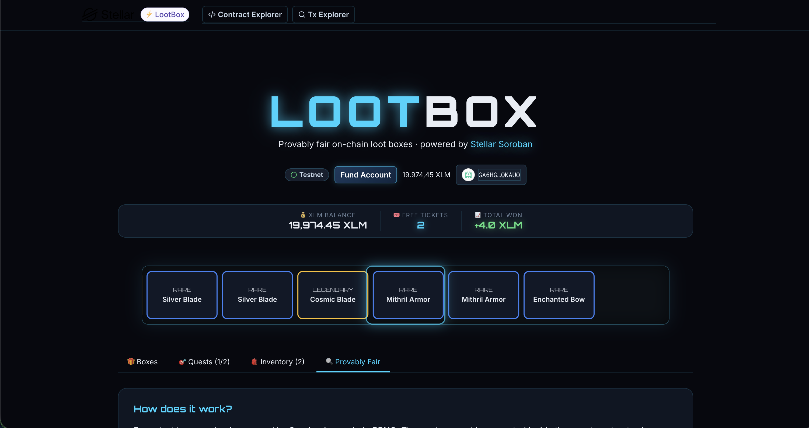
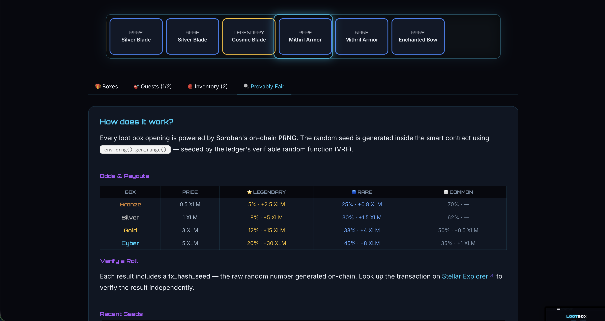
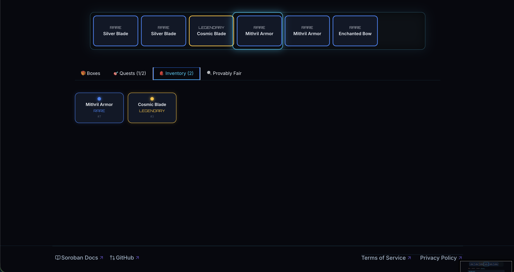
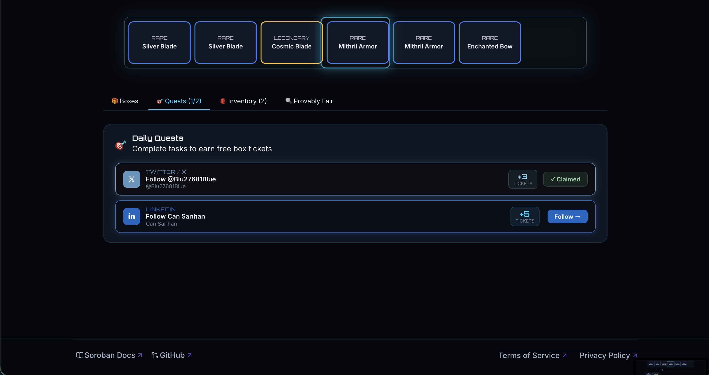
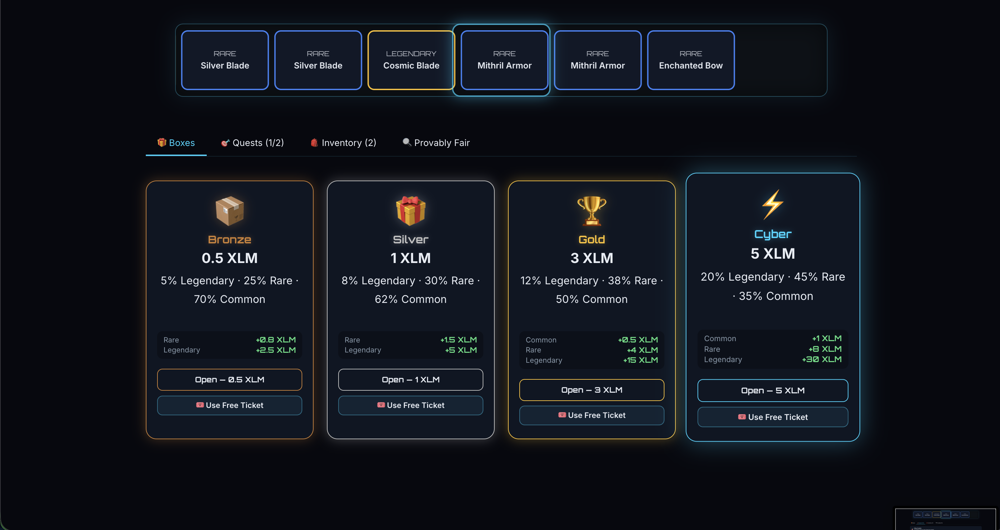

# LootBox — Provably Fair On-Chain Loot Boxes on Stellar


> **Open loot boxes. Win XLM. Verified on-chain.** > A transparent, provably fair loot box system powered by Stellar Soroban smart contracts.

---

## Project Description

LootBox is a decentralized loot box platform built on the Stellar blockchain using Soroban smart contracts. Players connect their Stellar wallet, choose a box tier (Bronze, Silver, Gold, or Cyber), and open boxes to win XLM rewards. Every roll is generated by Soroban's on-chain PRNG — seeded by the ledger's verifiable random function — making every result transparent and tamper-proof. No hidden algorithms, no server-side manipulation. The smart contract handles payments, randomness, and payouts in a single atomic transaction. Players can also earn free tickets by completing social quests, making the platform accessible to everyone.

---

## Screenshots

### User Experience & Interface

| **Main Dashboard** | **The Spinner** |
|:---:|:---:|
|  |  |
| *Choose your tier and start winning.* | *Provably fair on-chain randomization.* |

<br>

| **Box Opening** | **Inventory** | **Social Quests** |
|:---:|:---:|:---:|
|  |  |  |
| *Real-time winning results.* | *Manage your digital collection.* | *Complete tasks to earn free tickets.* |

---

## Vision

LootBox aims to redefine digital gaming economies by bringing full transparency to chance-based mechanics. In traditional gaming, loot box odds are hidden and unverifiable. On Stellar, every roll is recorded on-chain and auditable by anyone. We envision a future where all gaming reward systems are provably fair, where players truly own their outcomes, and where blockchain technology creates a new standard of trust in digital entertainment. LootBox is the first step toward a fully transparent, community-driven gaming ecosystem on Stellar.

---

## Features

| Feature | Description |
|---|---|
| **4 Box Tiers** | Bronze (0.5 XLM) · Silver (1 XLM) · Gold (3 XLM) · Cyber (5 XLM) |
| **Roulette Spinner** | CS:GO-style animated reel with Framer Motion |
| **Real XLM Payouts** | Rare & Legendary items pay out real XLM from the prize pool |
| **Provably Fair** | Every result includes an on-chain seed for independent verification |
| **Social Quests** | Follow on Twitter/LinkedIn to earn free box tickets |
| **Inventory** | Track all opened items in your personal gallery |
| **Dark UI** | Neon-themed dark interface with real-time wallet balance |

---

## Odds & Payouts

| Box | Price | Legendary | Rare | Common |
|---|---|---|---|---|
| Bronze | 0.5 XLM | 5% · +2.5 XLM | 25% · +0.8 XLM | 70% · — |
| Silver | 1 XLM | 8% · +5 XLM | 30% · +1.5 XLM | 62% · — |
| Gold | 3 XLM | 12% · +15 XLM | 38% · +4 XLM | 50% · +0.5 XLM |
| Cyber | 5 XLM | 20% · +30 XLM | 45% · +8 XLM | 35% · +1 XLM |

---

## Software Development Plan

### Step 1 — Smart Contract (Soroban / Rust)
* `open_box(player, box_tier, use_ticket)` — core function
* On-chain PRNG via `env.prng().gen_range()`
* XLM transfer in/out within single transaction
* `add_funds()` for prize pool management

### Step 2 — Contract Deployment
* Build with `cargo build --target wasm32v1-none --release`
* Deploy to Stellar Testnet via `stellar contract deploy`
* Fund prize pool via `add_funds`

### Step 3 — TypeScript Client Generation
* Auto-generate bindings with `stellar contract bindings typescript`
* Typed `LootResult`, `BoxTier`, `Rarity` interfaces

### Step 4 — Frontend (React + Tailwind + Framer Motion)
* Wallet connection via `@creit.tech/stellar-wallets-kit` (Freighter, xBull, etc.)
* Roulette spinner animation
* Real-time balance from Horizon API
* Quest system for free tickets

### Step 5 — Deployment
* Deploy contract to Stellar Mainnet
* Host frontend on IPFS / Vercel

---

## Installation

### Prerequisites

| Tool | Version |
|---|---|
| Node.js | v18+ |
| Rust + Cargo | latest stable |
| Stellar CLI | latest |
| Docker | for local network |

### Clone & Install

```bash
git clone [https://github.com/YOUR_USERNAME/loot-box.git](https://github.com/YOUR_USERNAME/loot-box.git)
cd loot-box
npm install